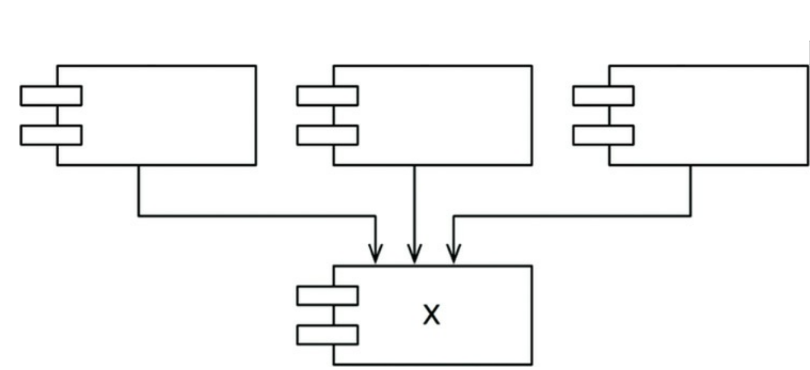
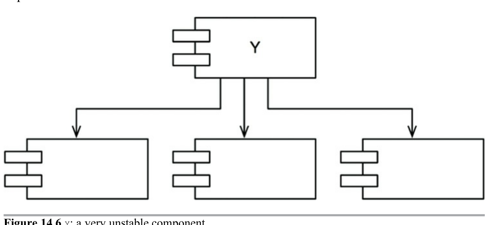
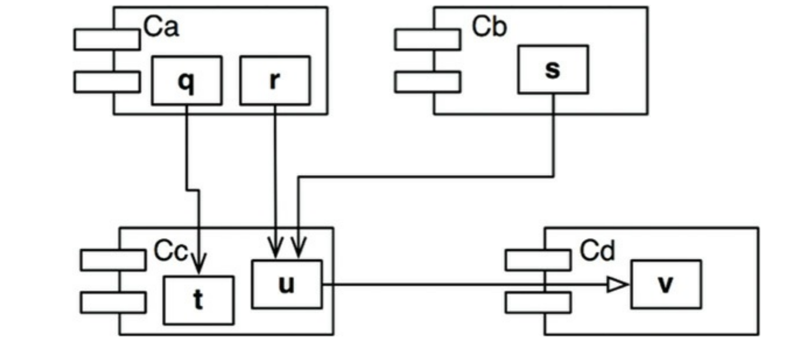

One sure way to make a software component hard to change is to make lots of components dependent on it. A component with lots of incoming dependencies is very stable because it requires a great deal of effort to reconcile any changes with all dependent components.

In above image X is a very stable component. Three components depends on X, so it has three good reasons not to change.X is responsible to those 3 components.
Conversely X depends on nothing, so it has no external influence to make it change. X is independent

Y is unstable component. No other components depends on Y. Y is irresponsible.
Y depends on three other components so changes may come from three external sources. Y is dependent

### Stability Metrics

Count the number of dependencies that enters and leave the component. This count will allow us to know the positional stability of the component

#### Fan_In: Incoming Dependencies
- This metrics identifies the number of classes outside this component that depends on classes within the component

#### Fan_Out: Outgoing Dependencies
- This metrics identifies the number of classes inside this component that depends on classes outside the component

#### I: Instability
I = Fan_Out / ( Fan_In + Fan_Out)
range - [0,1]
0 indicates maximally stable component
1 indicates maximally unstable component

We find that there are three classes outside Cc that depend on classes in Cc. Thus, Fan_In = 3.
Moreover, there is one class outside Cc that classes in Cc depend on. Thus, Fan_Out = 1 and I = 1/4. 

## The Stable Dependency Principle states that the I metrics of a component should be greater than the I metrics of a component it depends on. That is I metrics should decrease in the direction of dependency